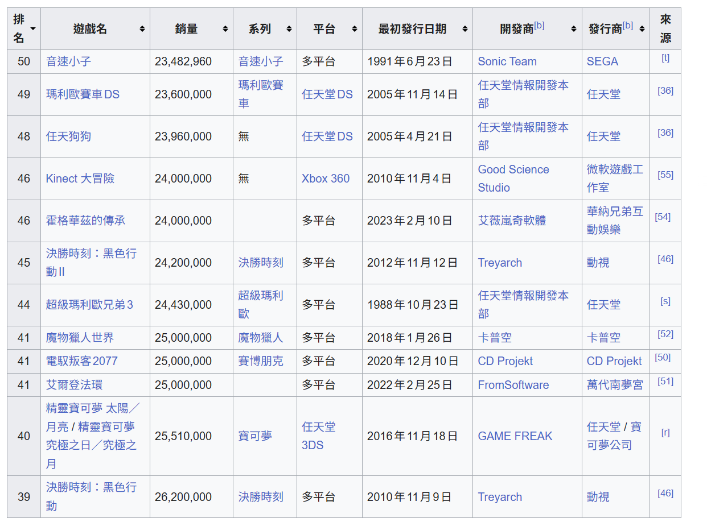
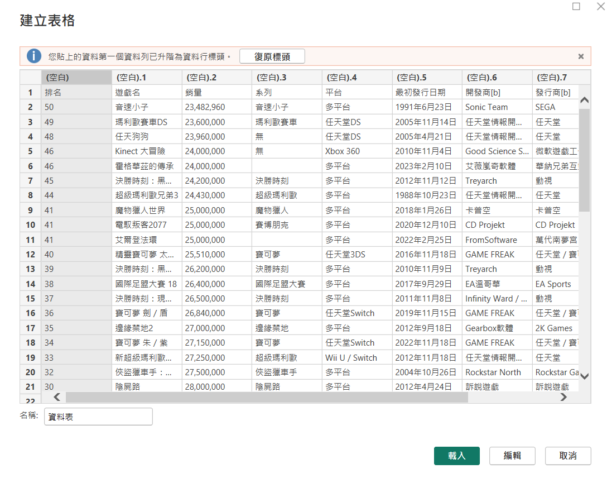
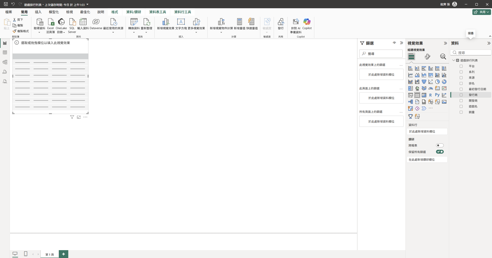
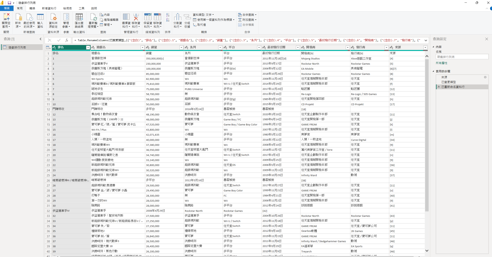

# 第1次練習題目-練習-PC1
>
>學號：112111136      (學號和姓名都要寫)
> 
>姓名：張紘齊
>

Ans: 
# 實作作業：Power BI 網頁資料直接輸入與轉換實作

本實作完全對照 Topic 4 投影片 p. 8 - p. 12 之流程規範，捨棄投影片使用之人口資料，改採維基百科之「暢銷電子遊戲列表」網頁進行資料直接輸入、模型載入與進階 Power Query 編輯實作。

* **實作網址：** https://zh.wikipedia.org/zh-tw/暢銷電子遊戲列表

---

### 步驟一：維基百科表格資料選取與複製（對應 p. 8 圖 2.1）
1. 使用瀏覽器進入維基百科的「暢銷電子遊戲列表」網頁。
2. 滾動至網頁下方的「列表」主題表格（欄位包含：排名、遊戲名、銷量、系列、平台、最初發行日期、開發商、發行商）。
3. 使用滑鼠將表格的所有數據內容進行**反白選取**，並按下 `Ctrl + C` 進行複製。

---

### 步驟二：Power BI 直接輸入資料與表格命名（對應 p. 8 - p. 9）
1. 開啟 Power BI Desktop。
2. 在上方【常用】功能區，點擊 **「輸入資料」** 按鈕，此時系統會彈出「建立表格」的獨立視窗。
3. 點選左上角第一個儲存格，按下 `Ctrl + V` 將剛才從維基百科複製下來的暢銷遊戲數據全數貼上。
4. **關鍵注意事項（對應 p. 9 提示）：** 保持系統預設，**切勿點選「復原標頭」**。確保第一列的「排名、遊戲名、銷量」等文字自動被提升為欄位標頭，以避免欄位變成「資料行1」、「資料行2」等無意義名稱。
5. 在視窗左下角的「名稱」輸入框中，將該資料表重新命名為具有分析意義的：**`全球暢銷電子遊戲表`**。
6. 確認無誤後，點擊右下角的 **「載入」** 按鈕，將數據封裝壓縮成二進位資料。

---

### 步驟三：於報告模型中確認遊戲欄位清單（對應 p. 10 - p. 11）
1. 資料下載與壓縮載入完成後，介面會自動返回 Power BI 的主畫布（報表檢視）。
2. 開啟右側的 **「資料」** 面板（新版介面顯示為「資料」標籤頁）。
3. 展開 **`全球暢銷電子遊戲表`** 物件，確認從 Wikipedia 擷取過來的欄位（如：遊戲名、系列、平台、發行商、銷量等）已經完好無損地列在右側，可直接用於後續的視覺化圖表拉取。

---

### 步驟四：進入 Power Query 編輯器準備進行轉換（對應 p. 12）
1. 為了後續能夠針對「銷量」進行數字型態修正、或是對「平台」進行特徵拆解，點選上方功能列的 【常用】 分頁。
2. 點擊正中央的 **「轉換資料」**（或新版介面中的「查詢 ➡️ 轉換資料」）按鈕。
3. 系統將順利跳出並進入「Power Query 編輯器」視窗，正式完成投影片 p. 12 規範的資料清洗與編輯前置作業。

